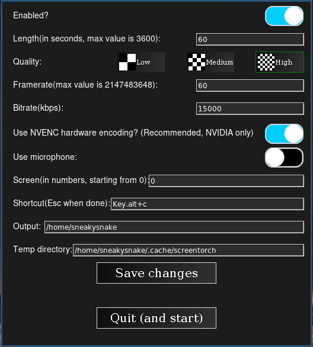

# screentorch
## An Instant Replay/ReLive-like program for Linux

# Featuring:
- A GUI written in TKinter
- NVENC encoding
- Microphone use(although somewhat limited and uses a dodgy solution to work)
- Customizable shortcut

# This is what the GUI looks like:

# Dependencies:
## PIP:
- Pillow
- pynput
## Programs:
- ffmpeg
- Xorg(because apparently ffmpeg doesn't work on Wayland)
- PulseAudio

# Installation:
- run "install" with your favourite shell

# TODO:
- Fix dodgy solutions and make code less spaghetti
- Add shortcut to stop ffmpeg
- Fix the final bit of the code so space could be saved
